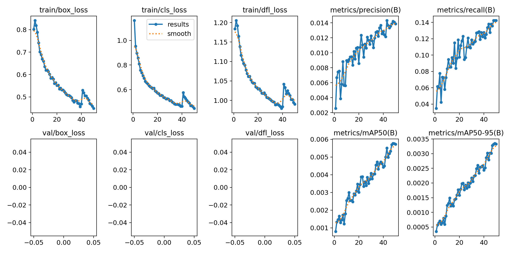
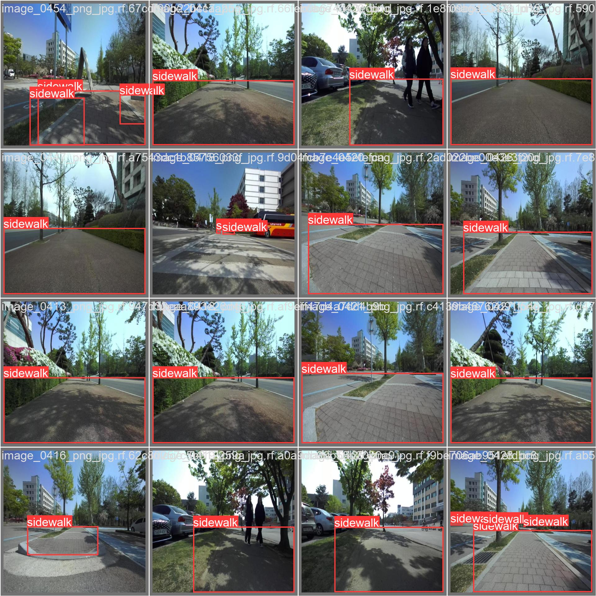

# ai2_WheelchairAssistent

longterm project of zhaw ai2 course

## summary

This Git repository contains the source code and trained model for a project aimed at enhancing accessibility for wheelchair users. The project involves training a YOLOv8 network model, optimized for small size, on a custom dataset specifically designed for detecting sidewalks. The trained model enables real-time analysis of video input, allowing for the detection of sidewalks in various environments.

Additionally, the repository includes heuristic functions that complement the model's capabilities. These functions are designed to support disabled wheelchair users in navigating their surroundings more effectively. By combining advanced deep learning techniques with tailored heuristics, the project aims to improve the mobility and independence of wheelchair users in urban environments.

## quick start

### install dependencies

`` pip install opencv-python ``

`` pip install ultralytics ``

tbd. there might be some more required dependencies

### run project

To run the project simply execute

`` py run.py ``

## custom trained yolo v8 model

You only look once (YOLO) is a state-of-the-art, real-time object detection system.
This repository hosts a custom-trained YOLOv8 model optimized for detecting sidewalks. The model was trained with a model size of "S" (Small) to balance performance and resource efficiency. Training was conducted over 50 epochs, utilizing a batch size of 8 to effectively learn from the custom dataset comprising over 5000 annotated images. The trained model enables real-time analysis of video input, facilitating sidewalk detection in various environments. Developers interested in sidewalk detection and accessibility enhancement can utilize this model for their projects.

### training results

### sidewalk detection examples

## heuristics

tbd.
